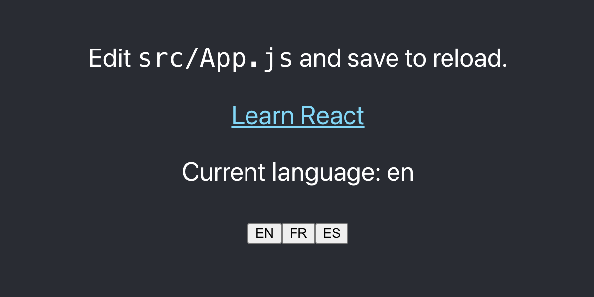
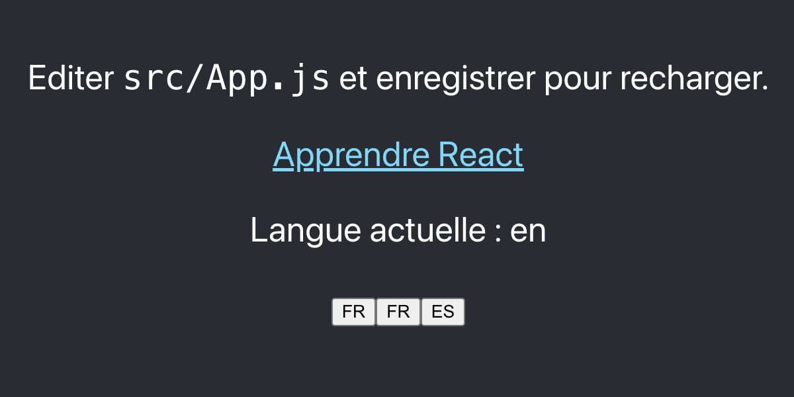

# React Component to Integrate Weglot Translation Widget
You can use this component to easily integrate Weglot Translation Widget into ReactJS or NextJS projects. TypeScript is also supported.
# Usage
## Setting Up Weglot
- Login to [Weglot](https://www.weglot.com/)
- [Setup translation](https://support.weglot.com/article/285-can-i-use-weglot-with-a-single-page-application) for `body` or any other appropriate tag. 
- Make sure to add all the languages you need
- Copy the `api_key`. This would be in format `wg_[0-f]{32}` (`wg_` followed by 32 hexademical characters)

## Installing `react-weglot`
- Install `react-weglot`
```shell
yarn add react-weglot
```
```shell
npm i react-weglot
```
- Import `useWeglot`
```typescript
import { useWeglot } from 'react-weglot';
```
- Create the `lang` and `setLang` variables using `useWeglot()` inside your component. (Optional) pass in the default language.
```typescript
const [lang, setLang] = useWeglot('wg_00000000000000000000000000000000', 'en');
```
- Now use these inside your functionality of buttons or loaders.

```jsx
import { useWeglot } from 'react-weglot';

export const Weglot = () => {
    const [lang, setLang] = useWeglot('wg_00000000000000000000000000000000', 'en');
    return (
        <div>
            <p>Current language: {lang}</p>
            <button onClick={() => setLang('en')}>EN</button>
            <button onClick={() => setLang('fr')}>FR</button>
            <button onClick={() => setLang('es')}>ES</button>
        </div>
    );
};
```
- Run your React codebase. 




